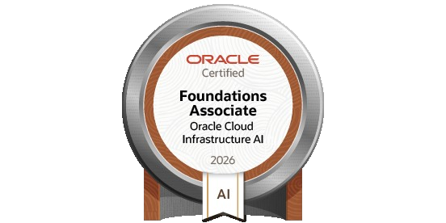

# 👋 Hola, soy Arturo

💻 Computer Systems Engineering @ ITVER  
🚀 Interesado en ML, IA Engineering, Cloud y Web Development

## 🔧 Tech Stack
- Python, JavaScript, Typescript
- TensorFlow / PyTorch / NestJs / NexJs / Vite / LangChain / LangGraph / HuggingFace
- Docker, AWS / GCP / Azure / OCI

## 🚀 Proyectos destacados
- IRIS → Sistema inteligente de tráfico
- Deriva → App web de colaboración estudiantil para los alumnos del ITVER
- Pegasus Agent → Agente de RAG para Pegasus, proyecto para el challenge de Oracle Next Education

## Badges
 

## 📫 Contacto
- LinkedIn: [Arturo Baez Solano](https://www.linkedin.com/in/arturo-baez-solano-1509213ba?utm_source=share_via&utm_content=profile&utm_medium=member_ios)
